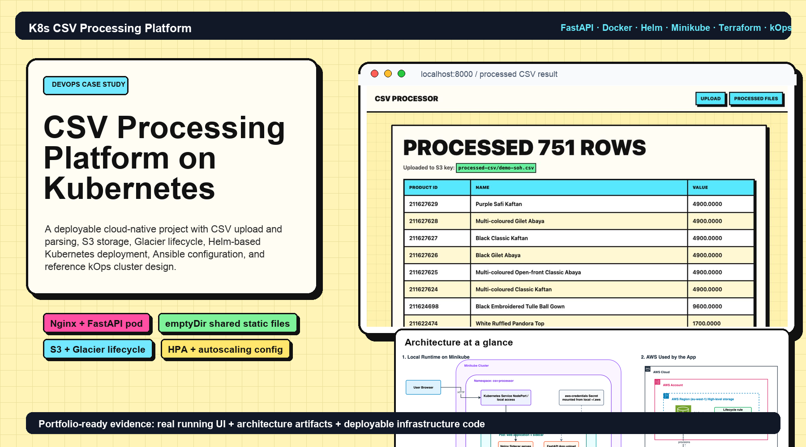
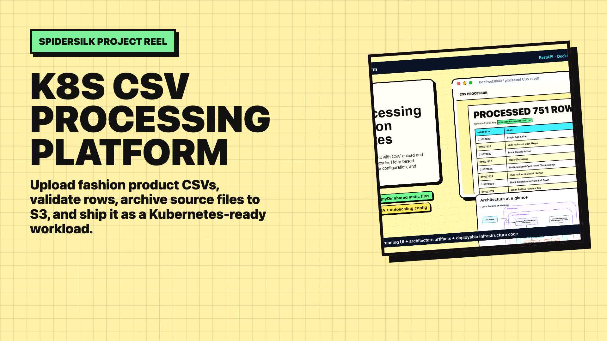
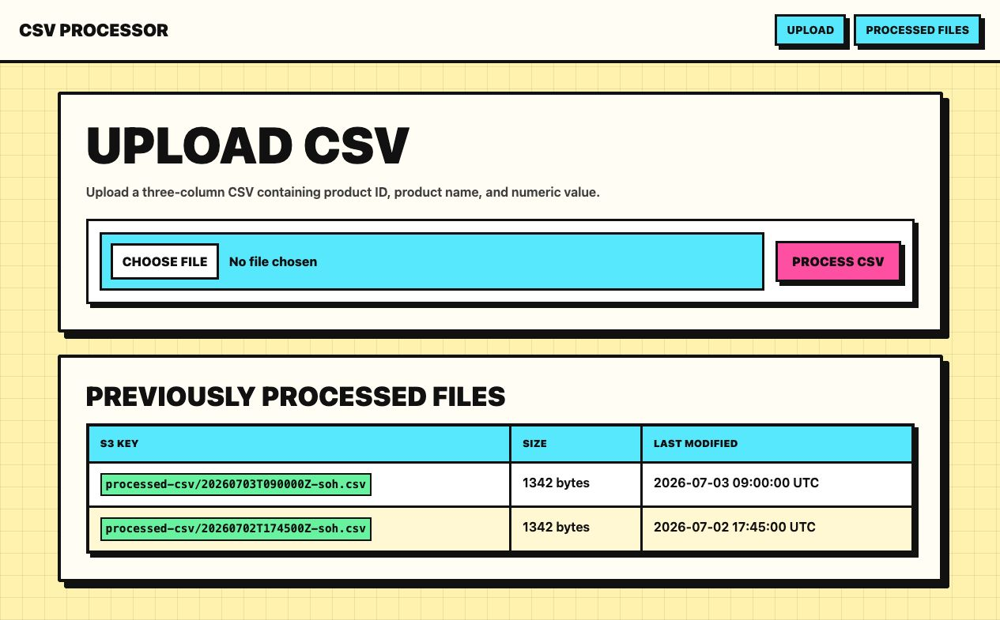
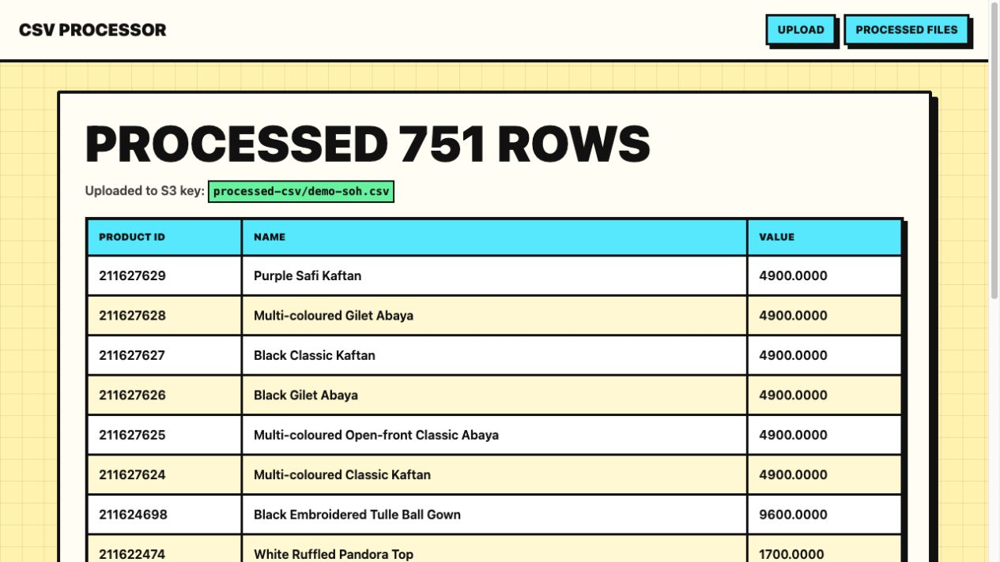
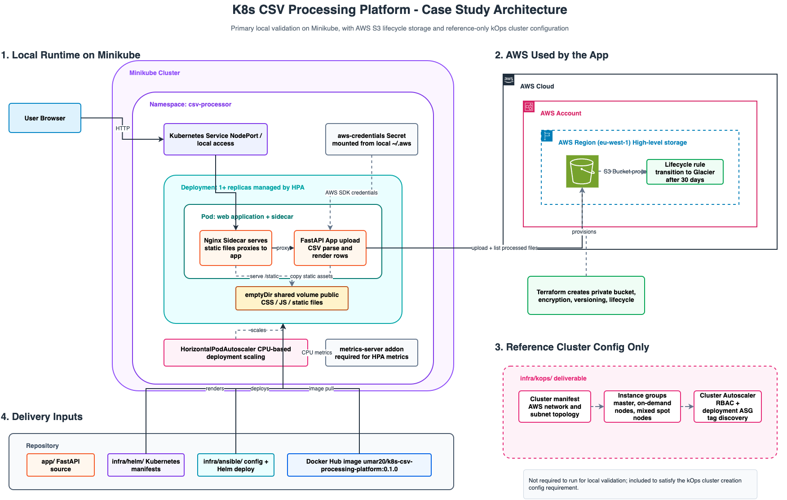

# K8s CSV Processing Platform



Enterprise-style DevOps case study for a CSV processing workload: a Python web application packaged with Docker, deployed to Kubernetes with Helm, configured through Ansible, backed by Amazon S3 with Glacier lifecycle management, and accompanied by reference kOps cluster creation manifests.

The project is intentionally practical. The application can be validated locally on Minikube, while the AWS and kOps assets show how the same workload would be prepared for cloud infrastructure review.

## Demo Reel

[](docs/k8s-csv-platform-demo-reel.mp4)

[Watch the neobrutalist project demo reel](docs/k8s-csv-platform-demo-reel.mp4)

## Project Evidence

### Application

Local upload dashboard:



Processed CSV result view:



The screenshots above were captured from the running local app with demo S3 data to avoid unnecessary AWS writes during documentation capture.

### Architecture



Editable Draw.io source is kept locally under `tmp/` during development and is not intended to be committed. The PNG export is stored in `docs/`.

## What This Implements

- FastAPI web application for uploading and parsing the provided `soh.csv` format.
- Browser UI that renders parsed CSV rows and previously processed files.
- S3 upload path for processed source files.
- Terraform-managed private S3 bucket with versioning, encryption, and Glacier lifecycle transition.
- Docker image for local and Kubernetes execution.
- Helm chart that renders reusable Kubernetes manifests.
- Kubernetes deployment with Nginx and the FastAPI app in the same pod.
- Shared static assets through an `emptyDir` volume, explicitly avoiding NFS.
- Kubernetes Service and HorizontalPodAutoscaler.
- Ansible playbook for environment-specific configuration and Helm deployment.
- Reference kOps cluster configuration with multiple instance groups, mixed spot capacity, on-demand capacity, and Cluster Autoscaler.
- Architecture documentation and project screenshots suitable for submission review.

## Repository Layout

```text
app/                    FastAPI app, templates, and static assets
tests/                  Unit tests for CSV parsing and app behavior
sample-data/            Sample CSV copied from the assignment attachment
docs/                   Architecture docs, exported diagrams, and screenshots
infra/helm/             Helm chart for Minikube/Kubernetes
infra/terraform/        S3 bucket and lifecycle configuration
infra/ansible/          Config management and Helm deployment playbook
infra/kops/             Reference kOps cluster and autoscaler configs
infra/nginx/            Nginx sidecar config reference
infra/scripts/          Local deployment helper scripts
```

## Architecture Summary

The local validation path runs on Minikube:

```text
Browser -> Kubernetes Service -> Nginx sidecar -> FastAPI app
                                      |              |
                                      |              +-> Amazon S3 processed CSV uploads
                                      +-> emptyDir shared static files
```

Terraform provisions the S3 storage layer. Helm renders the Kubernetes workload. Ansible provides a simple configuration-management path for applying environment-specific values. kOps manifests are included as reviewable cluster creation configuration, not as a required local runtime dependency.

## Prerequisites

- Python 3.11+
- Docker
- Minikube
- kubectl
- Helm
- Terraform
- Ansible
- AWS CLI configured with profile `aws-personal`

## Quick Local Run

```bash
python3 -m venv .venv
source .venv/bin/activate
make install
make test
make run
```

Open:

```text
http://localhost:8000
```

Upload:

```text
sample-data/soh.csv
```

## AWS S3 Setup

The application uses real Amazon S3 in both local and Kubernetes modes. Create the bucket with Terraform:

```bash
cd infra/terraform
terraform init
terraform plan -var='bucket_name=k8s-csv-processing-platform-<unique-suffix>'
terraform apply -var='bucket_name=k8s-csv-processing-platform-<unique-suffix>'
```

Terraform defaults:

- AWS profile: `aws-personal`
- AWS region: `eu-west-1`
- Glacier transition: after 30 days
- Object expiration: disabled by default

Export the bucket name:

```bash
export AWS_PROFILE=aws-personal
export AWS_REGION=eu-west-1
export S3_BUCKET_NAME=<terraform-output-bucket-name>
export S3_UPLOAD_PREFIX=processed-csv
```

## Docker

Build and run locally:

```bash
docker build -t umar20/k8s-csv-processing-platform:0.1.0 .
docker run --rm -p 8000:8000 \
  -e AWS_PROFILE=aws-personal \
  -e AWS_REGION=eu-west-1 \
  -e S3_BUCKET_NAME="$S3_BUCKET_NAME" \
  -e S3_UPLOAD_PREFIX=processed-csv \
  -v "$HOME/.aws:/home/appuser/.aws:ro" \
  umar20/k8s-csv-processing-platform:0.1.0
```

Publish to Docker Hub:

```bash
docker login
docker build -t umar20/k8s-csv-processing-platform:0.1.0 .
docker push umar20/k8s-csv-processing-platform:0.1.0
```

If Docker Desktop hangs while pulling public images because of its credential store, use a temporary Docker config:

```bash
mkdir -p /tmp/docker-no-creds
printf '{}' > /tmp/docker-no-creds/config.json
DOCKER_CONFIG=/tmp/docker-no-creds docker build -t umar20/k8s-csv-processing-platform:0.1.0 .
```

## Minikube Deployment

The Helm chart pulls the published Docker Hub image, so the same image reference can be reused across Minikube and other Kubernetes environments.

```bash
minikube start
minikube addons enable metrics-server
```

Create the namespace and local AWS credentials secret:

```bash
kubectl create namespace csv-processor --dry-run=client -o yaml | kubectl apply -f -
kubectl -n csv-processor create secret generic aws-credentials \
  --from-file=credentials="$HOME/.aws/credentials" \
  --from-file=config="$HOME/.aws/config" \
  --dry-run=client -o yaml | kubectl apply -f -
```

Deploy:

```bash
helm upgrade --install csv-processor infra/helm/csv-processor \
  --namespace csv-processor \
  --set app.awsProfile=aws-personal \
  --set app.awsRegion=eu-west-1 \
  --set app.s3BucketName="$S3_BUCKET_NAME"
```

Access:

```bash
minikube service csv-processor -n csv-processor
```

## Ansible Deployment

Ansible stores environment-specific application settings and runs the Helm deployment against the local Kubernetes context.

```bash
ansible-playbook -i infra/ansible/inventory.ini infra/ansible/playbook.yml \
  -e s3_bucket_name="$S3_BUCKET_NAME"
```

## kOps Reference

The assignment asks for Kubernetes cluster creation configuration for kOps, but does not require a running kOps cluster. The `infra/kops/` directory contains:

- Cluster manifest
- Master instance group
- On-demand worker instance group
- Mixed spot worker instance group
- Cluster Autoscaler RBAC and deployment
- Portable replacement values and apply notes

These files are review artifacts for the production-cluster design path. They are not required for Minikube validation.

## Validation Commands

```bash
make test
make helm-template
make helm-lint
make terraform-validate
make ansible-check
```

Notes:

- `make test` requires Python dependencies from `make install`.
- `make ansible-check` requires `ansible-playbook` on the local machine.
- `make terraform-validate` expects Terraform initialization under `infra/terraform`.

## Cleanup

Remove local Kubernetes deployment:

```bash
helm uninstall csv-processor -n csv-processor
kubectl delete namespace csv-processor
```

Destroy S3 resources:

```bash
cd infra/terraform
terraform destroy -var='bucket_name=<your-bucket-name>'
```

## Documentation

See [docs/architecture.md](docs/architecture.md) for the design notes and data flow.
