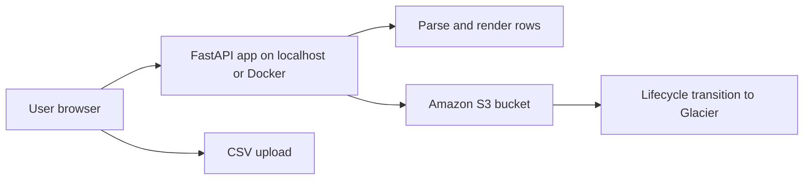
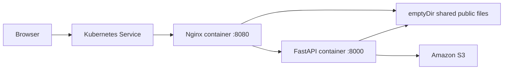
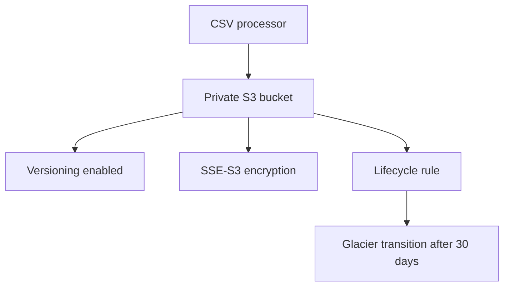
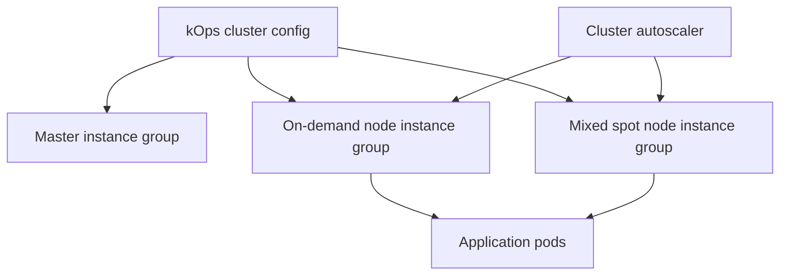

# Architecture

## Local Development Flow

## Kubernetes Pod Design

The app and Nginx run in the same pod. Public/static files are copied by the app into `/shared/public`, mounted by both containers through an `emptyDir` volume. This satisfies the shared storage requirement without using NFS.

## AWS Storage

Terraform creates the S3 storage layer for processed CSV files. The bucket is private, encrypted, versioned, and configured with lifecycle transition for processed CSV objects.

## kOps Reference Architecture

The kOps files are provided as reviewable infrastructure configuration. They are not applied in the local validation phase.

## Operational Notes

- Local mode and Minikube mode both use real Amazon S3.
- Minikube mounts AWS CLI credentials as a Kubernetes secret for local testing.
- Production AWS deployment should replace local AWS credential secrets with IAM roles for service accounts or node instance roles.
- The default Helm values use the published Docker Hub image so the same image reference can be reused across local Minikube and other Kubernetes environments.
